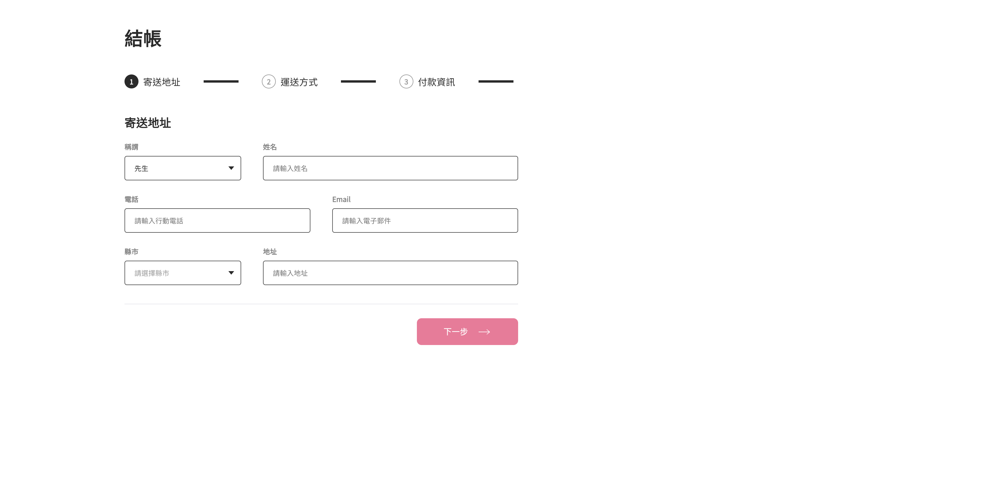
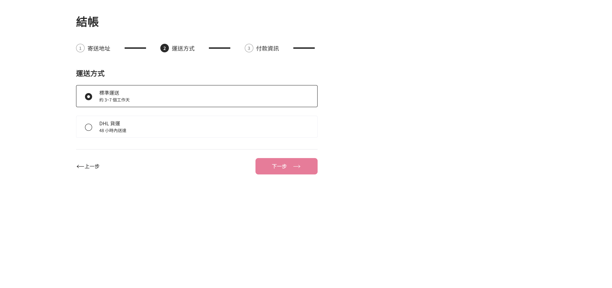
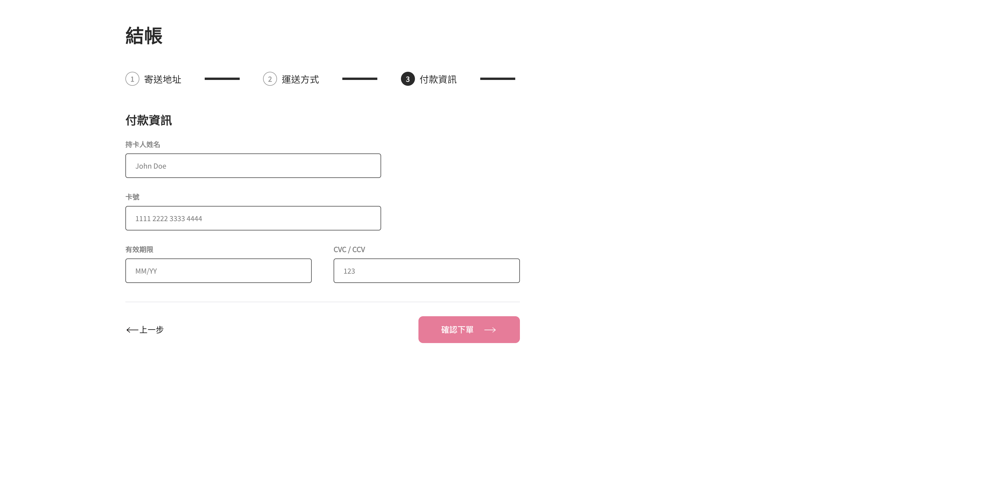

# ALPHA Shop

## Project Progress
透過React框架進行開發[ALPHA Shop](https://www.figma.com/file/8D1kUmCDV02GGGroemX8SF/ACCapstone%3A-Frontend-UI) ，並且搭配 `styled-components` 撰寫，目前已經完成表單拆分元件。

因為還沒有加入程式判斷，所以顯示的畫面都是使用step變數去做手動操控。

## Project Preview

## Project Usage Guide
  1. `npm install` 安裝所需要的檔案
  2. `npm start` 啟動專案
